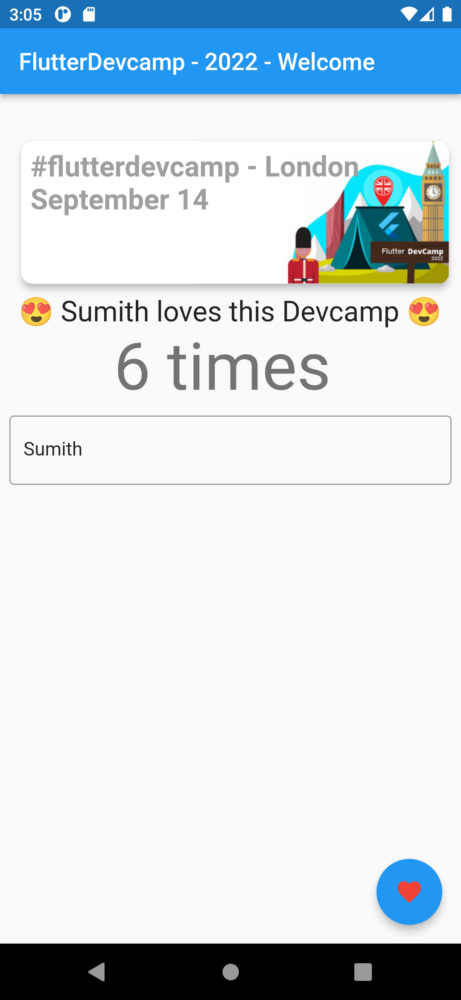

# flutterdevcampapp
Starting point for flutterdevcamp

Initial Code for checking prerequsite

## Step 1 Starting Point
All this has already been run

```powershell
md app 
cd app
flutter create flutter_devcamp
cd flutter_devcamp
flutter run
ls
cd .\lib\
md helpers
md models
md providers
md screens
md services
md widgets
cd ..
code .
flutter run
```
## To Test 
make sure you are in **flutter_devcamp** directory

```powershell
flutter pub get
flutter run
```

## Repo Code

